<div align="center">

# STEM Visualizer

### Manim-quality explainers for any STEM concept — built with plain web tech, rendered to 1080p60 video, and playable as interactive decks.

**Calculus · Physics · Chemistry · Computer Science · Biology**

<br/>

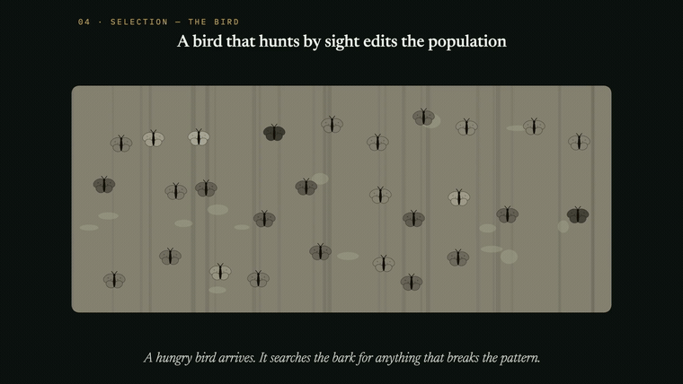

<sub><i>Natural selection, in motion — a bird edits the population one visible moth at a time.</i> · <a href="explainers/natural-selection/natural-selection.mp4">▶ watch the full 1080p60 video</a></sub>

</div>

---

## See the idea move

Every concept is choreographed beat by beat — the visuals carry the explanation, the equation arrives only after you've already watched what it says.

<div align="center">
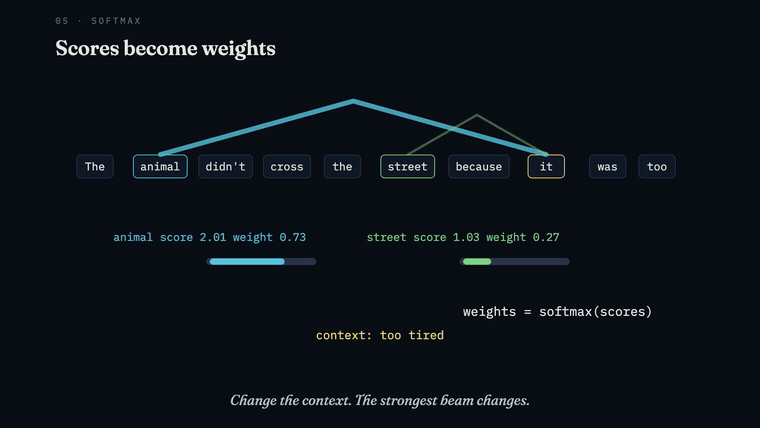

<sub><i>Self-attention — queries reach for keys, scores become weights, values blend back in.</i> · <a href="explainers/self-attention/self-attention.mp4">▶ watch the full 1080p60 video</a></sub>
</div>

---

## The web app

One Vite/TypeScript app surfaces every explainer from a single registry — pick a lesson to watch its video, or step into interactive mode to drive the deck yourself.

<div align="center">
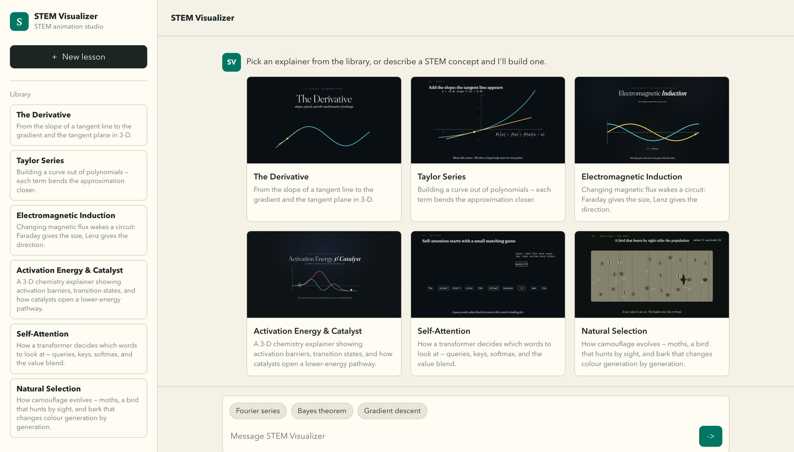
</div>

---

## Step in and play

Interactive mode embeds each lesson's standalone HTML deck — drag points, push sliders, and re-run the simulation. These are the moments the video can only show you once.

<table>
<tr>
<td width="50%" valign="top">
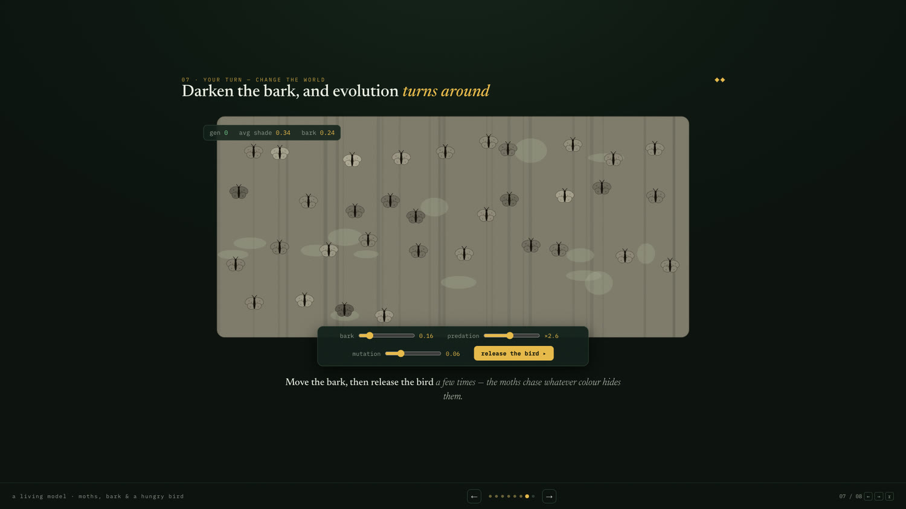
<sub><b>Natural Selection</b> — darken the bark, tune predation and mutation, then release the bird and watch the population chase its camouflage.</sub>
</td>
<td width="50%" valign="top">
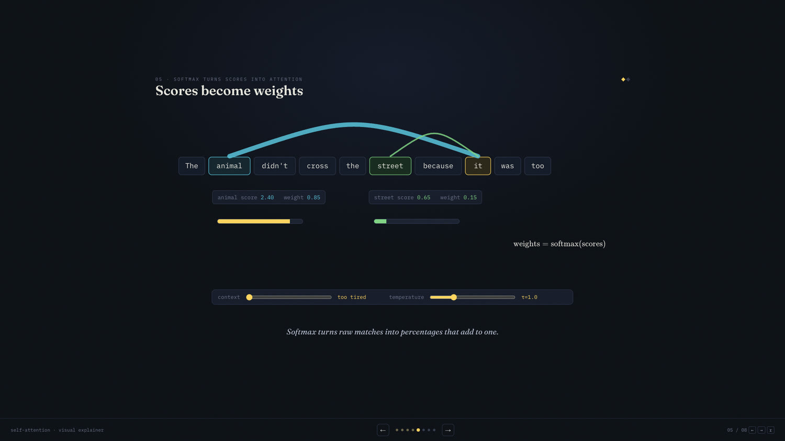
<sub><b>Self-Attention</b> — drag the query, sharpen or soften the softmax with the temperature slider, and re-blend the values live.</sub>
</td>
</tr>
</table>

---

## The library

Six explainers, five subjects — each one a `deck.html`, a rendered `.mp4`, and a poster, all wired into the app from one registry entry.

<table>
<tr>
<td width="33%" align="center">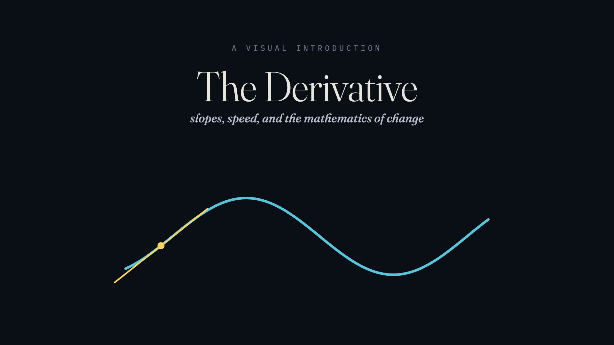<br/><b>The Derivative</b><br/><sub>Calculus · <a href="explainers/derivative/derivative.mp4">video</a> · <a href="explainers/derivative/deck.html">deck</a></sub></td>
<td width="33%" align="center">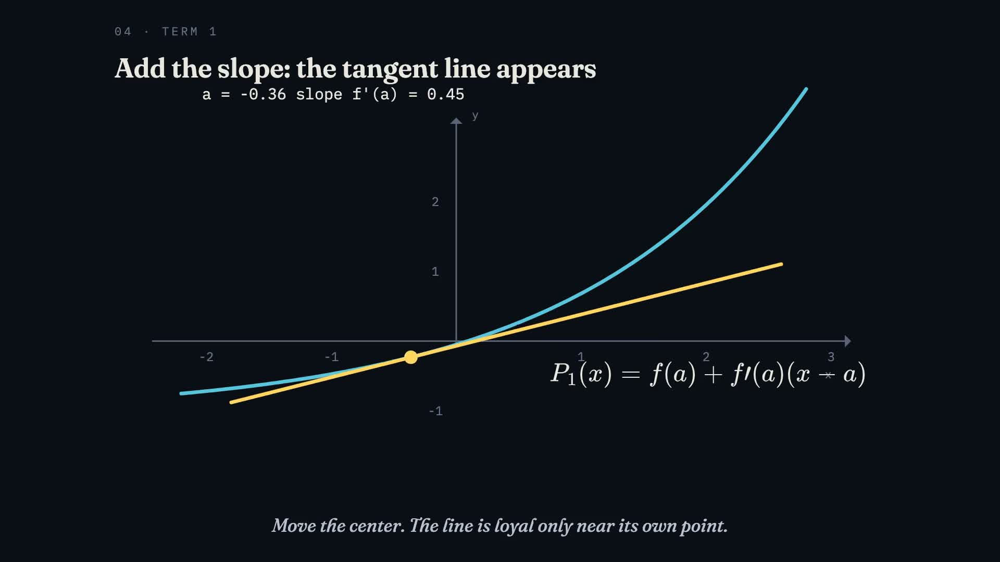<br/><b>Taylor Series</b><br/><sub>Calculus · <a href="explainers/taylor/taylor.mp4">video</a> · <a href="explainers/taylor/deck.html">deck</a></sub></td>
<td width="33%" align="center">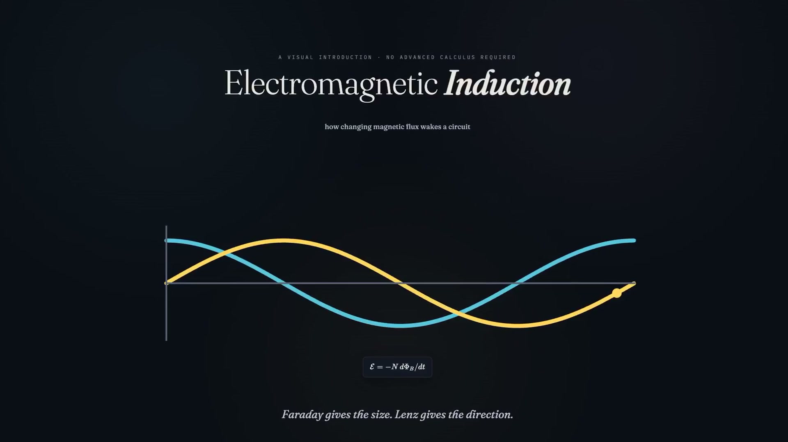<br/><b>Electromagnetic Induction</b><br/><sub>Physics · <a href="explainers/electromagnetic-induction/electromagnetic-induction.mp4">video</a> · <a href="explainers/electromagnetic-induction/deck.html">deck</a></sub></td>
</tr>
<tr>
<td width="33%" align="center">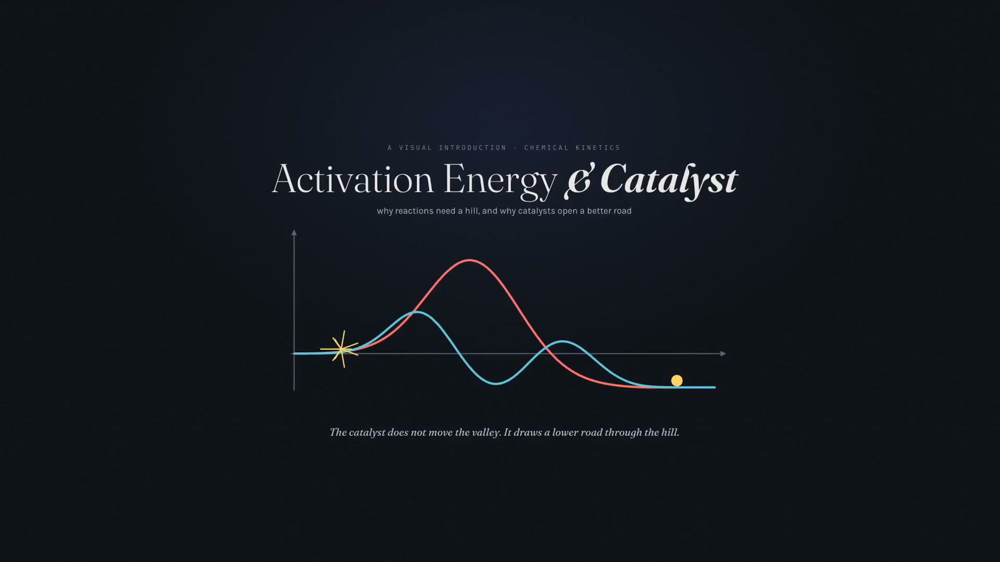<br/><b>Activation Energy &amp; Catalyst</b><br/><sub>Chemistry · <a href="explainers/activation-energy-catalyst/activation-energy-catalyst.mp4">video</a> · <a href="explainers/activation-energy-catalyst/deck.html">deck</a></sub></td>
<td width="33%" align="center">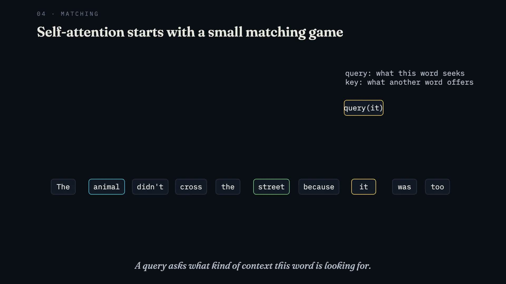<br/><b>Self-Attention</b><br/><sub>Computer Science · <a href="explainers/self-attention/self-attention.mp4">video</a> · <a href="explainers/self-attention/deck.html">deck</a></sub></td>
<td width="33%" align="center">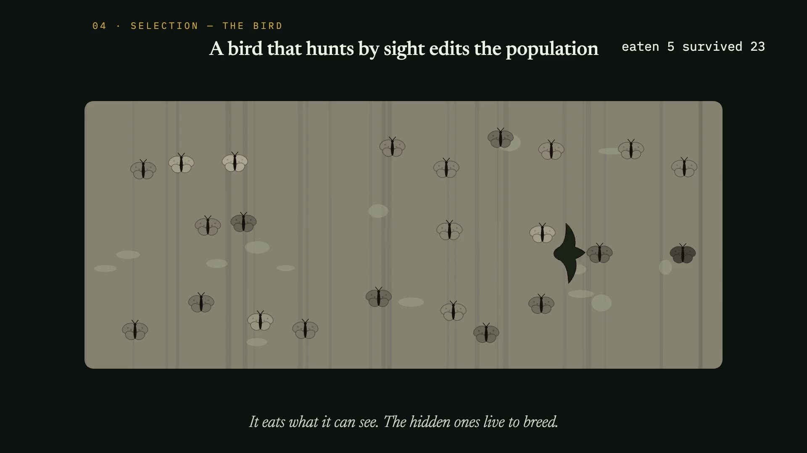<br/><b>Natural Selection</b><br/><sub>Biology · <a href="explainers/natural-selection/natural-selection.mp4">video</a> · <a href="explainers/natural-selection/deck.html">deck</a></sub></td>
</tr>
</table>

---

## Run it locally

```bash
npm install
npm run dev        # opens the web app at http://127.0.0.1:8765
```

Open any deck on its own — no build step needed — by pointing a browser at `explainers/<id>/deck.html`.

To work on a video project (render via the Motion Canvas editor's RENDER button):

```bash
cd explainers/<id>/motion-canvas
npm install
npx vite
```

Requirements: Node ≥ 22, ffmpeg, and python3 + numpy (for the ambient music generator, `explainers/<id>/gen_music.py`).

---

## How it's built

| Path | What it is |
|---|---|
| `src/` + `index.html` | The Vite/TypeScript web app — library, video player, and iframe-embedded interactive mode. Renders entirely from the registry. |
| `explainers/<id>/` | One self-contained lesson — `deck.html`, `<id>.mp4`, `poster.jpg`, `gen_music.py`, and the `motion-canvas/` project that renders the video. |
| `explainers/registry.ts` | **Single source of truth.** Adding a lesson = drop a folder + append one entry; it shows up in the app with no further wiring. |
| `.claude/skills/math-deck-video/` (mirrored at `.codex/skills/`) | **The agent skill** — a complete playbook (design taste, deck architecture, Motion Canvas port recipe, music/mux pipeline, phase-gate checklist) so a coding agent can produce a new explainer end to end. |

See **[ARCHITECTURE.md](ARCHITECTURE.md)** for the full structure and the recipe to add a new explainer.

### Building a new explainer with the skill

The `math-deck-video` skill is discovered automatically by an agent running in this repo (Claude Code scans `.claude/skills/`, Codex scans `.codex/skills/`). Then ask:

> Build a visual explainer for eigenvectors — both the interactive deck and the rendered video.

The agent works the phases: lesson design → HTML deck (verified slide by slide in a browser) → Motion Canvas port → 1080p60 render → music + mux → frame-by-frame verification.
